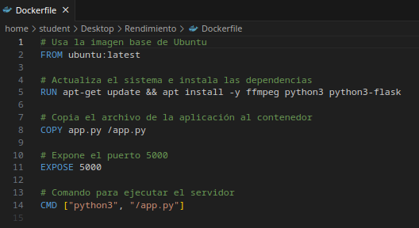
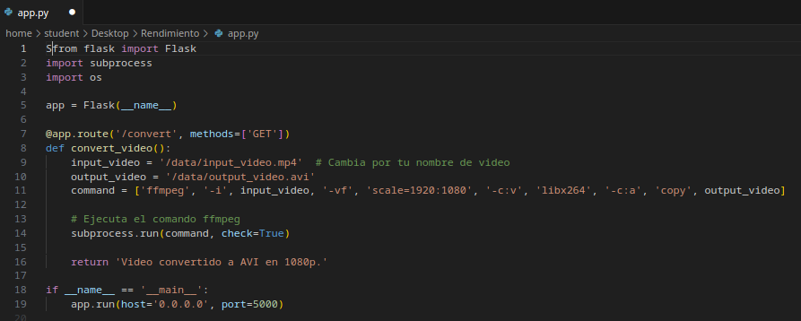

# Practica 1 - Felix Sanz - Pruebas de carga V1

## Introducción y objetivos

A lo largo de este apartado, se pretende explicar como se ha implementado un pequeña arquitectura que permitirá evaluar la escalabilidad de
uno de los servicios dados por "Smart Photos". La práctica tiene los siguientes objetivos:

    - Familiarizarnos con herramientas apra pruebas de carga (JMETER en este caso).
    - Familiarizarnos con la notacion asintótica.
    - Identificar cuellos de botella para el tipo de servicio implementado.


## Descripción de la solución

Uno de los servicios a proporcionar por "Smart Photos" es la conversion del formato y calidad de los videos / imagenes que los usuarios hayan añadido a
la plataforma. Este servicio puede demandar una gran cantidad de recursos de computacion, mas aun si los videos tiene una larga duracion y su calidad 
es alta.

Para implementar este servicio y poder realizar pruebas de carga, se ha creado una imagen Docker (a partir de un Dockerfile), con las funcionalidades
necesarias: python3, flask y las herramients de ffmpeg instaladas. Por lo tanto, el contenido del fichero Dockerfile será el siguiente:




Como JMETER permite hacer pruebas de carga desde el lado cliente, será necesario implementar un servicio web local que permita recibir peticiones y enviar
una respuesta una vez realizada la conversión. Para ello, implementamos en python y con flask un servicio web en un documento "App.py":



Este servicio, escuchará (en localhost:5000) las peticiones realizadas desde un navegador o desde JMETER, procesará el video cambiando su formato, calidad y 
guardando una nueva copia, y devolverá un mensaje de confirmación al terminar.


Para poder hacer la conversion del video se utilizará FFMPEG. El comando utilizado para hacer la conversion se indica en el siguiente apartado.


## Comando utilizados

Los siguientes comandos han sido utilizados para poder realizar este apartado:

### Pruebas sobre FFMPEG (es necesario tener instalada la herramienta):
```bash
# Genera un video 4k y con extensión .mp4:
ffmpeg -f lavfi -i color=c=blue:s=3840x2160:d=5 -r 30 -c:v libx264 -pix_fmt yuv420p input_video.mp4
```

```bash
# Cambia el formato de un video a 1080p y extension .avi :
ffmpeg -i input_video.mp4 -vf scale=1920:1080 -c:v libx264 -c:a copy output_video.avi
```

### Comandos sobre contenedores Docker
```bash
# Crear el contenedor a partir del Dockerfile:
docker build -t ffmpeg-server .
```

```bash
# Correr el contenedor:
docker run -d -v /home/student/Desktop/Rendimiento/output:/data -p 5000:5000 ffmpeg-server
```

```bash
# Comprobar el funcionamiento de todos los contenedores (Status):
docker ps -a
```
Una vez creado e inicialiado el contenedor, debemos comprobar que este genera un nuevo video cuando se realiza una consulta web. Como este contenedor 
funciona sobre una maquina virtual de Kubuntu, y esta ultima funciona a su vez sobre un host windows, habra que configurar en los ajustes de la maquina
un nuevo interfaz de red en modo Bridge.

Una vez realizado discho ajuste, y comprobando las direcciones IP en cada caso, hacemos la consulta desde el navegador del Host Windows:
http://192.168.60.145:5000/convert


### JMETER

Para poder lanzar peticiones simultaneas y observar el tiempo de respuesta, usaremos JMETER. Este software nos permite editar parametros como tipo de consulta y
su configuracion,y tambien el número de usuarios que hacen una petición.


Para realizar pruebas, primero se ha hecho una unica petición, fijando el valor de "Number of Threads" en 1. Posteriormente se han hecho pruebas con 2, 10 y
100 usuarios.

La configuración de las pruebas, asi como los resultados se almacenan en "Thread Group 1" en este directorio.


### Resultados

A continuación se comentan los resultados obtenidos para esta primera versión de pruebas de carga.

#### 1 usuario:
Cuando se realiza la petición con un unico usuario, el tiempo de servicio es de 6 segundos (ya que el servidor no manda la respuesta hasta que el video se ha generado).
Para este caso, tambien se ha comprobado que el aumento en el consumo de CPU del ordenador, pasando de un 30% cuando no hay peticiones a un 55% cuando hay 1 petición.


#### 2, 10 y 100 usuarios:
Se ha comprobado que cuando se hace mas de una petición simultanea, es la primera la que mas tarda, ya que es la que genera el video y provoca la respuesta una vez 
generado este. Para el resto de peticiones, parece que la respuesta del servidor se obtiene casi instantaneamente. Esto podría pasar debido a que el servidor considera
que el video ya esta generado en el directorio destino, por lo que automaticamente envía una respuesta. 
Adicionalmente, el consumo de CPU no aumenta en consonancia al nº de peticiones, lo que demuestra que no se estaría generando un video por cada petición.

Último Response que corresponde a la primera petición (llega la primera confirmación la última, ya que es la única que genera un video)


Anteúltimo Response que corresponde a la última petición (La última petición recibe una respuesta antes que la primera petición)


(Los resultados pueden verse en el documento "View Results Tree 1.jmx" incluido en este directorio)