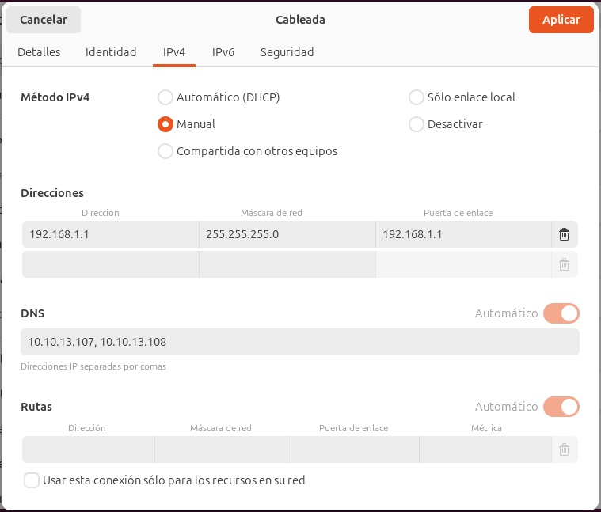

## Red

A continuación se añade la configuración de los distintos equipos involucrados en la práctica

### Equipos Workers sobre equipos ZX:
Se configuran sin sistema operativo, esperando el arranque desde la red

Equipo Z34 --> Nombre MV: Worker_2_Z34 --> RAM: 10240 MB, Procesadores x4, Memoria video 64 MB, Disco duro: 50 GB, Red: 1x puente en Realtec 
--> Solo arranque red y sin SSOO. ----> NOK (El PC no tiene un interfaz de red) --> Pasar a ordenador de Backup --> mac: 0800 275 123 B8 --> 169.254.156.155
ip 192.168.1.61 mask 255.255.255.0

Equipo Z42 --> Nombre MV: Worker_3_Z42 --> RAM: 10240 MB, Procesadores x4, Memoria video 64 MB, Disco duro: 50 GB, Red: 1x puente en Realtec --> Solo arranque red y sin SSOO. ----> OK
ip 169.254.255.104 mask 255.255.0.0 gw: 169.254.255.100

Equipo Z40 --> Nombre MV: Worker_4_Z40 --> RAM: 10240 MB, Procesadores x4, Memoria video 64 MB, Disco duro: 50 GB, Red: 1x puente en Realtec --> Solo arranque red y sin SSOO. ----> OK
ip 192.168.1.58 mask 255.255.0.0

Equipo Z19 --> Nombre MV: Worker_5_Z19 --> RAM: 10240 MB, Procesadores x4, Memoria video 64 MB, Disco duro: 50 GB, Red: 1x puente en Realtec --> Solo arranque red y sin SSOO. ----> OK
ip 169.254.255.108 mask 255.255.0.0 gw: 169.254.255.100

Equipo Z20 --> Nombre MV: Worker_6_Z20 --> RAM: 10240 MB, Procesadores x4, Memoria video 64 MB, Disco duro: 50 GB, Red: 1x puente en Realtec --> Solo arranque red y sin SSOO. ----> OK
ip 169.254.255.107 mask 255.255.0.0 gw: 169.254.255.100

Equipo Z21 --> Nombre MV: Worker_7_Z21 --> RAM: 10240 MB, Procesadores x4, Memoria video 64 MB, Disco duro: 50 GB, Red: 1x puente en Realtec --> Solo arranque red y sin SSOO. ----> OK
ip 192.168.1.56 mask 255.255.0.0

Equipo Z22 --> Nombre MV: Worker_8_Z22 --> RAM: 10240 MB, Procesadores x4, Memoria video 64 MB, Disco duro: 50 GB, Red: 1x puente en Realtec --> Solo arranque red y sin SSOO. ----> OK
mac: 0800 27B 137D5
ip 192.168.1.57 mask 255.255.255.0

z10 ip 169.254.255.101 mask 255.255.0.0 gw: 169.254.255.100

### Equipos K8s controladores todos sobre el equipo Z10:

Nombre MV: K8s_Etcd --> RAM: 8192 MB, Procesadores x2, Memoria Video 16 MB (por defecto), Disco duro: 25 GB, Red: 1x puente en Realtec --> Solo arranque red y sin SSOO. ----> OK

Nombre MV: K8s_Easyrsa --> RAM: 4096 MB, Procesadores x1, Memoria Video 16 MB (por defecto), Disco duro: 25 GB, Red: 1x puente en Realtec --> Solo arranque red y sin SSOO. ----> OK

Nombre MV: K8s_Apisaver --> RAM: 8192 MB, Procesadores x2, Memoria Video 16 MB (por defecto), Disco duro: 25 GB, Red: 1x puente en Realtec --> Solo arranque red y sin SSOO. ----> OK

dar una etiqueta con el destino (k8master, juju controller,...), para que no elija aleatorismente el equipo, 

   
