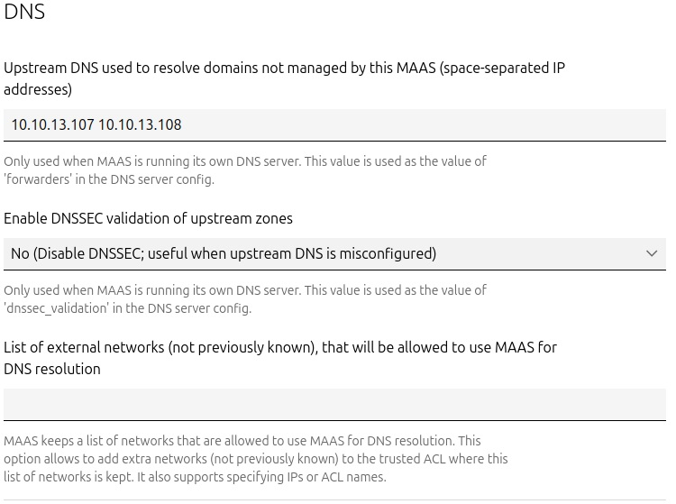
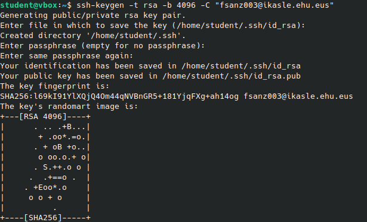
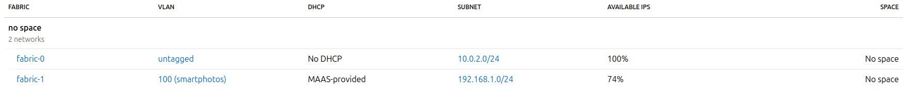
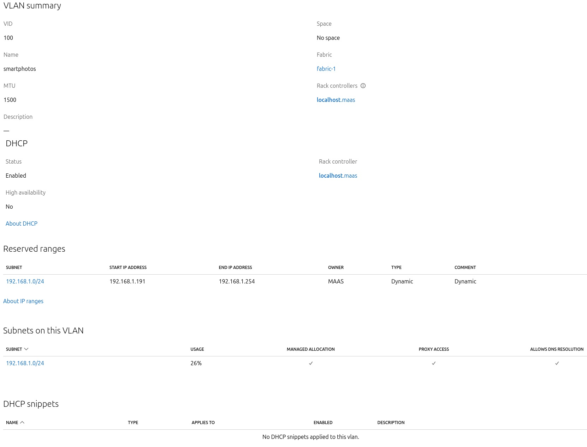
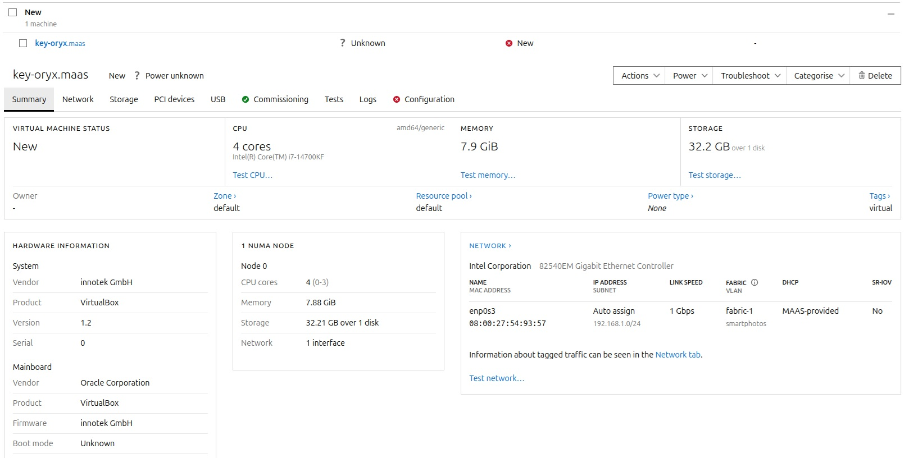

# Practica 2 - Parte MaaS


## Introduccion
MaaS, o Metal as a Service, es un modelo que permite a los usuarios administradores implementar y gestionar recursos de hardware físico de manera 
similar a cómo se gestionan los recursos en la nube. A través de interfaces de programación de aplicaciones (API) y herramientas de automatización, 
MaaS permite a los administradores de sistemas implementar y escalar servidores, redes y almacenamiento de forma rápida y eficiente. 

Esto simplifica la administración de centros de datos y facilita la asignación dinámica de recursos, reduciendo los costos asociados a la gestión del hardware. MaaS 
es especialmente útil en entornos de desarrollo, pruebas y producción que requieren escalabilidad en el uso de recursos físicos.

Durante esta práctica, se utilizará MaaS para cargar la configuración y recursos a los equipos Worker y controladores K8s.

### Equipo con Maas Controller sobre Z9 (sobre una máquina virtual de Kubuntu):

A continuación, se añaden los pasos llevados a cabo para instalar y configurar el controlador MaaS:
Para la instalación, hemos seguido el tutorial incluido en los apuntes de la práctica

#### 1. Descarga de la versión 3.4 de MaaS

En nuestro caso, descargaremos la version 3.4de MaaS. Para ello:

```bash
sudo apt-add-repository ppa:maas/3.4
sudo apt update 
sudo apt upgrade
sudo apt-get -y install maas
```

#### 2. Desabilitar systemd-timesyncd

```bash
sudo systemctl disable --now systemd-timesyncd
```

#### 3. Configuración previa de variables de entorno:
Configuramos algunas variables de entorno que se usarán durante la instalación de PostgreSQL:

```bash
export DBUSER="user"
export DBPASS="1234"
export DBNAME="userDB"
```

#### 4. Instalación de PostgreSQL:

```bash
sudo apt install -y postgresql
```

#### 5. Configuración de postgreSQL (base de datos y usuario)
Creamos un rol y una base de datos.

```bash
sudo -i -u postgres psql -c "CREATE USER \"$DBUSER\" WITH ENCRYPTED PASSWORD '$DBPASS'"
sudo -i -u postgres createdb -O "$DBUSER" "$DBNAME"
```

#### 6. Modificación del fichero pg_hba.conf en /etc/postgresql/14/main/:

Se edita el ficehro de configuración de PostgreSQL:

```bash
sudo nano pg_hba.conf
```

Al final del fichero, se añade lo siguiente:

```bash
host    userDB    user    0/0     md5
```

#### 7. Configurar usuario en MaaS e inicializar
Usamos `sudo maas init` (distinto al comando indicado en el tutorial, pues hemos descargado otra versión de MaaS).

```bash
sudo maas init
```

##### 7.1 Acceso de un usuario estándar

Durante la creación de un nuevo usuario, indicamos lo siguiente:
- **URL de Canonical RBAC:** no se indica nada pues no se usa.
- **Ruta de autenticación Candid:** no se indica nada pues no se usa.
- **Username:** usuario
- **Password:** 1234
- **Email:** fsanz003@ikasle.ehu.eus (podría ser otro, pero es importante no dejar vacío este campo).
- **SSH keys:** lo dejamos en blanco.

##### 7.2 Acceso como administrador

Para crear un usuario con privilegios de administrador, se indica lo siguiente:
- **URL de Canonical RBAC:** no se indica nada pues no se usa.
- **Ruta de autenticación Candid:** no se indica nada pues no se usa.
- **Username:** admin
- **Password:** admin
- **Email:** admin@maas.com (o el correo que prefieras, pero no dejes el campo vacío).
- **SSH keys:** lo dejamos en blanco, posteriormente se añade la clave SSH del administrador.

#### 8. Interfaz gráfica de MaaS:
Para acceder a la interfaz gráfica de MaaS y asi poder configurar el controladors, desde el navegador:

http://0.0.0.0:5240/MAAS


#### 9. Algunas otras instalaciones:
Se incluyen algunas herramientas que pueden ser de utilidad después.

Para poder ver la configuración de interfaces de red:
```bash
sudo apt install net-tools
```
Para utilizar Wireshark:
```bash
sudo apt install wireshark
```

#### 10. Configuración del controlador MaaS desde el GUI
Una vez accedemos desde el navegador al GUI de MaaS

##### 10.1 Iniciar sesión
Iniciamos sesión con las credenciales indicadas en el paso 7 del anterior apartado.

##### 10.2 Configuración de los DNS
Utilizaremos los servidores DNS de la universidad: 10.10.13.107 10.10.13.108

   

##### 10.3 Imagen a cargar:
Indicamos la imagen que deseamos cargar: Ubuntu 22.04 LTS y arquitectura AMD64.

    

##### 10.4 Añadir la clave SSH al usuario MaaS:
Obtenemos la pareja de claves pública-privada e importamos la clave pública a MaaS. Para ello, primero la generamos:

```bash
ssh-keygen -t rsa -b 4096 -C "admin@maas.com"
```
Una vez se ejecuta el comando, se piden cumplimentar los siguientes campos:
- **file:** se indica el que proporciona por defecto `cat ~/.ssh/id_rsa`.

   

A continuación, se copia la clabe pública generada:

```bash
cat ~/.ssh/id_rsa.pub
```

Y se añade al Maas User:
1. Inicia sesión en la interfaz web de MAAS.
2. Ve a **Username** (esquina superior derecha) > **Preferences**.
3. En la sección **SSH keys**, haz clic en **Add key**.
4. Pega tu clave pública SSH en el campo y guárdala.

##### 10.5 Configuración DHCP, VLAN y Subred

1. En **Networking** > **Subnets**:
   - Habilita el DHCP.
   - Crea la subred `192.168.1.0/24` con el gateway del equipo MAAS `192.168.1.1`.
   - Asigna a esta subred la VID (VLAN ID) `100` con el nombre `smartphotos`.

   A continuación, se muestran las imágenes con la configuración final:

   

   

##### 11 Configuración de Nodos PXE

1. Habilita el arranque/apagado remoto de máquinas VirtualBox mediante el script `vboxpower.py` del proyecto **vboxpower** (asegúrate de haber completado los pasos previos necesarios).
2. Arranca las máquinas para que las comisione MAAS.
3. Configura los webhooks correspondientes para que MAAS realice arranque/apagado automático.
4. Accede por SSH a los nodos y verifica:
   - Espacio en disco
   - Uso de CPU
   - Uso de RAM

   

------------>   Sesion extra de laboratio del miercoles 06/11/2024 ----------------------
--------------------------------------------------------------
--------------------------------------------------------------
--------------------------------------------------------------
## Se establece un nuevo servidor MAAS: 

-Detalles que tenemos en cuenta:
## 1.) La direccion IP donde ejecutamos MAAS debe ser con la direccion de la interfaz (Ethernet PCI) con la que tenemos la red interna.

En nuestro caso, usamos la red 192.168.1.0, con IP 192.168.1.1 (configuracion manual) para la interfaz de la refinterna. Debemos usar  http://192.168.1.1:5240/MAAS/

## 2.) Nos dimos cuenta de que no hacia falta una vlan, porque ya disponemos de un router y un switch para conectar los ordenadores (usando la segunda interfaz y configuracion HDCP manual).

## 3.) Los ordenadores tienen que desactivar DHCP automatico, y configurarlo manualmente.

Debemos desactivar el DHCP automatico en los ordenadores y configurarlos manualmente (OS nativo).

No olvidar que en la MV Kubuntu tambien debe debe configurarse manualmente la IP de la segunda interfaz. Esto es porque el segundo adaptador de red está en modo Bridge. 
Esta asignación manual de la segunda IP en Kubuntu es necesaria, porque es con la que accederemos a controlar el servidor MAAS. 

## 4.) Checar con wireshark las transmisiones entre el worker y el servidor maas.

Se ve que hay el proceso con DHCP para hacer discovery, offer, request y ackwnowledge- Sin embargo, en adelante ya no se obtenía ningún mensaje para la transferencia TFTP. Finalmente se encontró que el firewall bloqueaba las peticiones para tftp.

## 5.) Verificar que el firewall de kubuntu permita la comunicación con la red interna.

En su defecto, podemos desactivar totalmente el firewall para que deje pasar todo (solo porque es un entorno de prueba).
Esto es porque tuvimos el problema de que los ordenadores con netboot no podian iniciar el proceso con protocolo TFTP para la transferencia del ubuntu ephimeral, para que inicie la comision.
Durante el netboot se obtenia una IP del DHCPD del MAAS, pero luego salia el siguiente mensaje: 
"PXE-e32 tftp ...time out"

Probar primero:
~$ sudo ufw enable [this will enable the ufw firewall]
~$ sudo ufw default allow [this will allow all the incoming connections to the server]

Para no dejar todos expuesto, hacemos:
~$ sudo ufw enable
~$ sudo ufw default deny
~$ sudo ufw allow 69/udp
Con esto TFTP funciona. Es lo que nos tomo más tiempo.
https://ubuntuforums.org/showthread.php?t=1576005

## 6.) Estamos listos para hacer una pruena de netboot con ordenador que tendra una MV worker.

Configurar manualmente la IP de la interfaz interna (IP 192.168.1.61 255.255.255.0)
Iniciamos la máquina virtual.

## 7.) Estado NEW en el ciclo de vida del nodo.

El servidor MAAS asignó un IP (en el rango dinamico que configuramos en MAAS para dhcpd).

Inició la descarga de un ubuntu ligero, y tambien recoge datos de la configuracion del ordenador virtual (espacio de disco, RAM asignada,...)

Luego de un rato, la maquina virtual se cerro sola.
En MAAS/Machines, la maquina tiene estado NEW con un aviso en rojo.

## 8.) Configuracion de Encendido (aviso en rojo).

Ubicarse dentro de Maas/Machine/<nombre de la maquina>/Configuration.
Ir a la ultima parte para editar o configurar un plan de encendido (POWER).
Elegir la opcion WeebHook.
-Para el encendido "http://<ip interna del ordenador que aloja al worker>:<Puerto>/<nombre de la mv>/on"
-Para el apagado "http://<ip interna del ordenador que aloja al worker>:<Puerto>/<nombre de la mv>/off"
-Para info de status "http://<ip interna del ordenador que aloja al worker>:<Puerto>/<nombre de la mv>/status"
-confirmaciones, dejarlo así
-el resto son opcionales (user pssw)
Guardar.

## 9.) Configurar accionamiento automatico (POWER) de las MV.

Mediante un script proporcionado por el profesor.
El script de python contiene instrucciones que automatizan la accion de POWER ON/OFF de la maquina virtual.
La configuración se realiza en el OS windows Nativo.
-Ir a la configuracion avanzada de firewall.
-En la reglas de entrada y salida, eliminar las reglas de python existentes.
-crear una nueva regla que implemente ese script de "POWER/ON/OFF/STATUS".

Con esto evitamos bloquear las ordenes de ON/OFF/STATUS que el server MAAS quiera gestionar sobre la mv worker.

## 10.) Ejecutar el script python.

En el cmd del OS nativo de la mv worker, dirigirse hasta la directorio del script.
Luego, ejecutar "python vboxpower.py"
Es posible que haya que ejecutar 2 veces el script, porque a veces no hace caso desde el server.
La ejecucion del script  muestra la IP que el OS nativo usa para NAT, y tambien puerto. Tener en cuenta el puerto para hacer las prueba en la MV donde está el MAAS.

## 11.) En la MV del server MAAS (solo en mv, no en el MAAS).

Ingresar a un terminal de la mv
-Ejecutar un curl a la IP del worker (IP interna del OS nativo)
  sudo curl <IP interna del os nativo>:<port>
  sudo curl 192.168.1.61:5241

La respuesta del curl debe mostrar lo que recoge el script en el OS nativo de la mv worker:
-El nombre de la MV del worker
-y las opciones de power a ejecutar.
-Podermos ver el estado de la maquina/nodo haciendo:
  sudo curl 192.168.1.61:5241/<nombre_de_la_mw>/status
-Y eso nos muestra si la maquina esta en running/stop/off

## 12.) Configuraion para el COMMISION de la machine del worker

Nos vamos al server MAAS (ya con el script corriendo en el OS nativo de la mv worker).
Seleccionamos nuestra 'machine'.
Luego, en la parte superior seleccionar la opcion 'Take Actions'.
De las opciones que se despliegan, escoger "Commision" (es la unica disponible en ese momento).
Seleccionar las siguiente:
  -allow ssh access
  -skip configuring supported BMC
  -retain network config
  -retain storage config
Luego, presionar 'start commisioning'.

## 13.) Renudacion del ciclo de vida del nodo.

La accion de comisionar activa las opciones para controlar el arranque de la mv del worker (gracias al script de python).

En el ordenador de la mv del worker, veremos que se inicia automaticamente la mv del worker para continuat con el COMMISION.

En MAAS, es status de la machine/nodo cambian a commissioning, y continua con la descargas.

## 14.) Pase al estado READY

Cuando termina la comission, y esta ha sido exitosa (incluido los logs). Entonces la maquina cambia al estado Ready. 

Este estado indica que el nodo está listo para recibir el despliegue del ubuntu que hayamos escogido (ubuntu 22.0.4)

Ahora sí podemos apagar y encender la mv del worker desde el server MAAS.

## 15.) Fin del avance
-workers en estado Ready.

-Falta configurar el servidor juju y k8s.

-Hasta aqui llegamos este miercoles.


