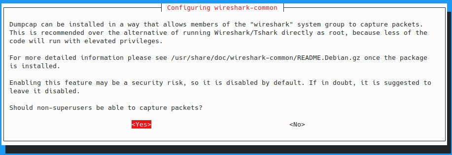
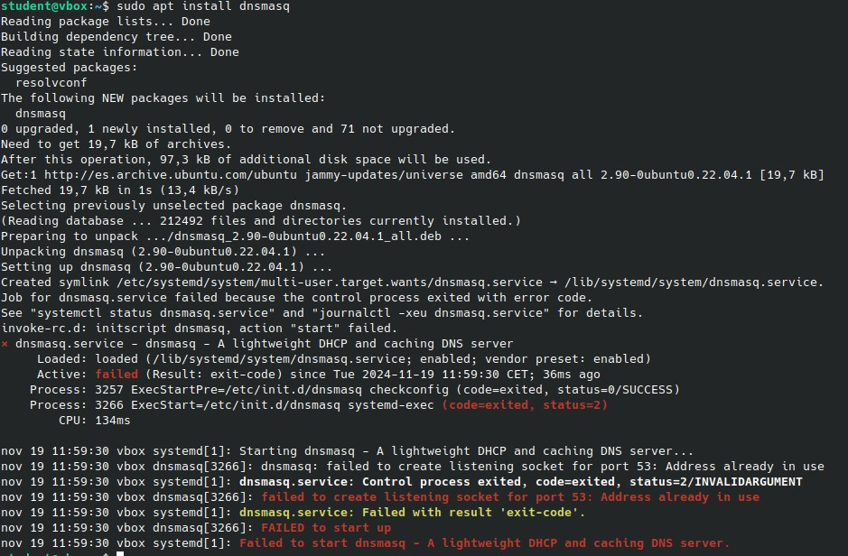
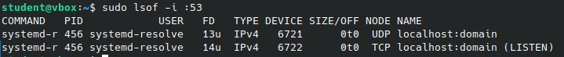
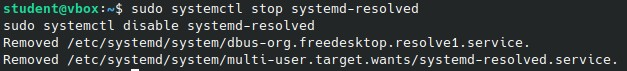
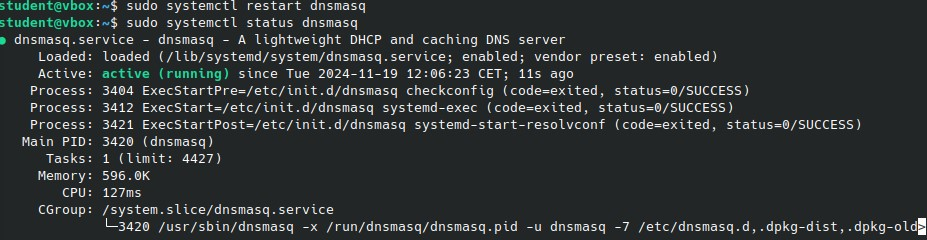
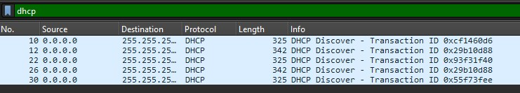
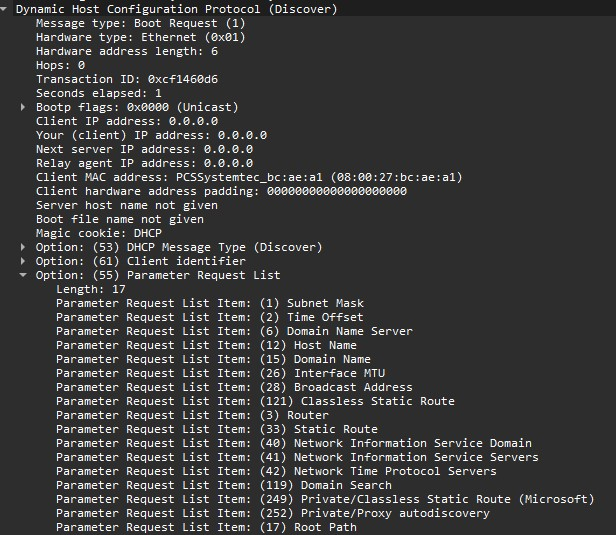

# Practica 2 - Parte PXE


## Introduccion
A lo largo de la primera parte de la practica 2, nos familiarizaremos con el arranque por red de distintos equipos usando PXE.

PXE (Preboot Execution Environment) es un protocolo que permite arrancar un sistema operativo a través de la red, en lugar de usar dispositivos locales como discos duros o unidades USB. Es utilizado en entornos donde se necesita implementar múltiples sistemas de manera rápida y eficiente, como en centros de datos o redes corporativas.

En nuestro caso, realizaremos el arranque de un equipo al que se le cargará Ubuntu.


## Instalación y configuración de Wireshark, DNSmasq y otras herramientas
A lo largo de este apartado, indicaremos los procesos llevados a cabo par ainstalar distintas herramientas

### 1º Instalación de Wireshark
Para poder analizar el trafico intercambiado entre el equipo configurador y el equipo configurado, utilizaremos Wireshark. Para instalar wireshark, usaremos el siguiente comando:

```bash
sudo apt update
sudo apt install wireshark
```


Durante la instalación, se nos preguntará si deseamos permitir que usuarios que no sean root puedan capturar paquetes. Indicaremos que si para evitar problemas, lo que creará automaticamente el grupo "wireshark".


### 2º Instalación de DNSmasq
Dnsmasq es una herramienta que combina un servidor DNS, un servidor DHCP y soporte para TFTP. Está diseñado para ser fácil de configurar y operar en redes pequeñas y medianas.

```bash
sudo apt update
sudo apt install dnsmasq
```



Durante el proceso de instalación se nos indicará un error, ya que el puerto 53 está siendo utiliado por otro proceso. 

Verificamos que proceso está utilizando el puerto:

```bash
sudo lsof -i :53
```



Systemd-resolved está ocupando el puerto, por lo que lo deshabilitamos para liberarlo y asi permitir que DNSmasq lo utilice:

```bash
sudo systemctl stop systemd-resolved
sudo systemctl disable systemd-resolved
```




Para comprobar que el funcionamiento de DNSmasq va a ser el correcto, lo reiniciamos:

```bash
sudo systemctl restart dnsmasq
sudo systemctl status dnsmasq
```




Una vez instalado, realizaremos su configuracion, editando el fichero "dnsmasq.conf"

```bash
kate /etc/dnsmasq.conf
```

Definimos el/los servidores DNS a utilizar, que en este caso serán los de la universidad, y no, por ejemplo, los de google, ya que la red de la universidad bloquea dichos DNSs.

```bash
server=10.10.13.107
server=10.10.13.108
```

Configuramos el rango de direcciones IP a dar:

```bash
dhcp-range=192.168.1.90,192.168.1.150,12h
```


Habilitamos el TFTP integrado en DNSmasq: tambien, indicamos el directorio del cual se obtendrá la informacion a cargar.

```bash
# Enable dnsmasq's built-in TFTP server
enable-tftp
tftp-root=/var/lib/tftpboot
```


Habilitamos el arranque mediante PXE:

```bash
dhcp-boot=pxelinux.0
```


Deshabilitamos las funciones DNS propias de DNSmasq:

```bash
# Listen on this specific port instead of the standard DNS port
# (53). Setting this to zero completely disables DNS function,
# leaving only DHCP and/or TFTP.
port=0
```

Reiniciamos dnsmasq

```bash
sudo systemctl restart dnsmasq
sudo systemctl status dnsmasq
```


### 3º Confifuración del arranque por PXE:

Instalamos el entorno que permite el arranque de los dispositivos por red:
```bash
sudo apt update
sudo apt install pxelinux syslinux-common grub-pc-bin tftp-hpa
sudo apt-get syslinux
```

Instalamos el paquete ubuntu-server:

```bash
sudo apt install ubuntu-server
```

Copiamos en /var/lib/tftpboot los fichero necesario para configurar el servidor PXE:

```bash
sudo cp /usr/lib/PXELINUX/pxelinux.0 /var/lib/tftpboot/
sudo cp /usr/lib/syslinux/modules/bios/menu.c32 /var/lib/tftpboot/
```

Creamos el directorio pxelinux.cfg, doonde despues ubicaremos el fichero default, con el contenido indicado:

```bash
sudo mkdir -p /var/lib/tftpboot/pxelinux.cfg
```

```bash
DEFAULT ubuntu
LABEL ubuntu
  KERNEL vmlinuz
  INITRD initrd.gz
  APPEND root=/dev/nfs nfsroot=192.168.1.1:/var/lib/tftpboot/ubuntu/ ip=dhcp
```

Instalamos el servidor NFS (Network File System) que permite compartir directorios de tu sistema con otros dispositivos en una red

```bash
sudo apt install nfs-kernel-server
```

Instalamos la imagen de ubuntu que queremos instalar en el equipo a arrancar. 

```bash
wget https://releases.ubuntu.com/22.04/ubuntu-22.04.5-live-server-amd64.iso
```

Montamos la imagen que queremos utilizar, para asi poder acceder a los archivos necesarios:

```bash
sudo mkdir /mnt/ubuntu-iso
sudo mount -o loop ubuntu-22.04.5-live-server-amd64.iso /mnt/ubuntu-iso
```

Copiamos los ficheros necesarios en el directorio de trabajo, y desmontamos:

```bash
sudo mkdir /var/lib/tftpboot/ubuntu/
sudo cp /mnt/ubuntu-iso/casper/vmlinuz /var/lib/tftpboot/ubuntu/
sudo cp /mnt/ubuntu-iso/casper/initrd /var/lib/tftpboot/ubuntu/
sudo cp /mnt/ubuntu-iso/casper/ubuntu-server-minimal.squashfs /var/lib/tftpboot/ubuntu
sudo umount /mnt/ubuntu-iso
```

Editamos el fichero /etc/exports:

```bash
kate /etc/exports
```

```bash
/var/lib/tftpboot/ubuntu *(rw,sync,no_subtree_check,no_root_squash)
```

Nos aseguramos de que aplicamos la ocnfiguración:

```bash
sudo exportfs -a
sudo systemctl restart nfs-kernel-server
```


### 4º Instalación de otras herramientas utiles
Instalaremos algunas otras herramientas que podrían ser de utilidad, como por ejemplo htop y net-tools.

```bash
sudo apt update
sudo apt install htop net-tools
```

## Análisis de los resultados mediante Wireshark
A continuacion, se analizan los resultados del intento de arranque de un euqipo del laboratorio.

Como puede verse en la imagen a continuación, se han capturado mensajes DHCP Discover sucesivos enviados por el equipo cuya configuracion es necesario proveer. 



Como vemos en el detalle de los paquetes intercambiados, el equpo a configurar esta solicitando, entre otros, informacion de red, como por ejemplo, la IP y  mascara de red, si tiempo de validez, su DNS, etc. 



El envío de tantos mensajes de dicho tipo sin respuesta permite ver que algo de la configuración no funciona correctamente, pues el equipo que deberia contestar a dichas peticiones con un DHCP Response, incluyendo la informacion solicitada.