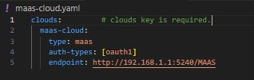
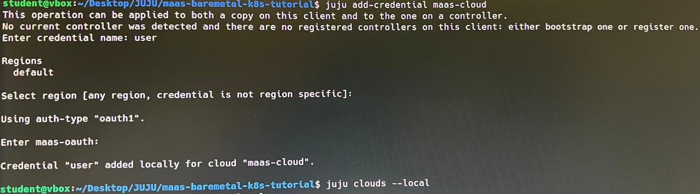
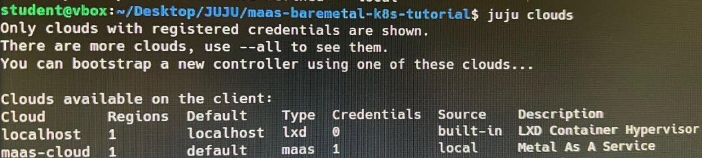

# Practica 3 - Container as a Service (CaaS)


## Introduccion
A lo largo de la siguiente práctica, aprenderemos a utilizar Juju . En particular, aprenderemos a orquestar aplicaciones utilizando el entorno propuesto por Canonical para ello, en este caso Juju. 

Juju es una herramienta de orquestación y gestión de aplicaciones en la nube que simplifica el despliegue, configuración, escalado y administración de aplicaciones y servicios en diferentes entornos, ya sean locales, en la nube pública o en nubes privadas.

Tras la explicacion teorica, instalaremos el cliente de Juju en 3 equipos distintos, uno por alumno. Configuraremos los clientes, añadiendo una nueva nube e indicando sus credenciales. Posteriormente, crearemos el controlador y tambien añadiremos nuebas maquinas a la nube.


## Instalación del cliente Juju
El cliente Juju se instalará en 3 equipos, unos por componente de este grupo. Para ello, se ejecutarán los siguientes comandos:

### 1º Instalacion de juju mediante Snap:
Instalamos Juju mediante el siguiente comando:

```bash
sudo snap install juju --classic
```

### 2º Registamos la nube:
Para registrar una nueva nube. debemos primero editar el fichero "maas-cloud.yml". En este fichero, en la linea de "endpoint", indicaremos la URL en la 
que escucha el controlador de MaaS; http://192.168.1.1:5240/MAAS, quedando el fichero de la siguiente forma:




Una vez realizada esta configuracion, ejecutamos el siguiente comando, que registrará una nueva nube en Juju, para que Juju pueda desplegar y gestionar servicios en ella.

```bash
juju add-cloud maas-cloud maas-cloud.yaml
```

### 3º Generamos unas nuevas credenciales para la nube creada:
Debemos generar unas credenciales para la nube recien creada. Para ello, ejecutaremos el siguiente comando, en el que indicamos la nube sobre la que crear las credenciales:

```bash
juju add-credential maas-cloud
```

Despues de ejecutar ese comando, se nos pedirá que indiquemos:
    - El nombre para las credenciales (nosotros indicamos "user")
    - La region (pulsamos enter dejandola por defecto) 
    - La autenticacion MaaS. Para obtener este valor, en el GUI del controlador mas, pulsaremos sobre la cuenta, seleccionamos API KEY y copiamos el nº mostrado por pantalla.




### 4º Verificamos la correcta creación de la nube y la asignación de las credenciales:
Para verificar que hemos creado correctamente la nube, podemos usar el siguiente comando, el cual, nos listará las nubes creadas y su estado. En nuestro caso, se nos muestra la nube creada, su región (default), el origen (local) y se marca con un '1' el apartado de credenciales, ya que se o acabamos de añadir.

```bash
juju clouds
```




### 5º Creación del Controller:
A continuación, inicializaremos un único controlador Juju en la nube que acabamos de crear, "maas-cloud". Para iniciar ese controlador, indicaremos a Juju que le pida al controlador MaaS una maquina cuya tag coincida con "juju-controller", tag que habremos configurado en la maquina que albergará el controlador Juju, desde le controlador MaaS.


```bash
juju bootstrap maas-cloud --bootstrap-constraints "tags=juju-controller"
```

Para que el proceso se realice de forma correcta, será necesario que el equipo con el controlador MaaS tenga el Firewall desactivado, y que, además, sea capaz de transmitir hacia el extreior las peticiones de conexion a Internet provenientes de los equipos que controla:;

```bash
sudo ufw disable
sudo ufw status
sudo iptables -t nat -A POSTROUTING -o enp0s3 -j MASQUERADE
```

Aprovechamos para añadir un nuevo modelo, ya que se nos pedirá que lo hagamos:
```bash
juju add-model my-model
```


### 6º Verificamos el estado:
Para comprobar el estado de la nube y sus equipos (por ahora solo el controlador), podemos usar el siguiente comando:

```bash
juju status
```


### 7º Añadir nuevas maquinas a la nube:
Una vez verificado que tenemos un controlador activo en la nube de Juju creada, podemos añadir a dicha nube mas maquinas, que serán gestionadas por Juju. En este caso, podremos añadir las maquinas worker, las cuales estan identificadas en el controlador MaaS con el tag "Worker".

Para ello, usamos el siguiente comando, el cual, solicita que Juju provisione una nueva maquina en la nube, aplicando las restricciones indicadas, en este caso el tag, que debe ser Worker:

```bash
juju add-machine --constraints "tags=Worker"
```


## Instalación / sincronización de los clientes Juju
Una vez que ya hemos creado el controlador e indicado el modelo desde unos de los clientes, debemos sincronizar los otras dos clientes. Para ello, instalamos Juju en los otros 2 ordenadores, y despues, en el ordenador inicial (con el cliente ya ocnfigurado), hacemos lo siguiente:

### 1º Creamos un usuario:

Creamos un nuevo usuario mediante el siguiente comando:

```bash
juju add-user user 1
```

### 2º Asignamos roles / permisos a dicho usuario:
Al usuario creado, le asignamos permisos para acceder al controlador y al modelo. Al controlador podrá acceder con permisos de superusuario y al modelo como administrador

```bash
juju grant user1 superuser
juju grant user1 admin mymodel
```

### 3º Compartimos con el nuevo usuario el ID obtenido:
Al crear el usuario, se nos devolverá un ID, que debe ser compartido con los nuevos usuarios. IMPORTANTE: para evitar errores, quitar de dicho ID la ultima letra y añadimos "=".

```bash
juju register [ID]
```

Tras ejecutar este comando, pedirá añadir una contraseña (user) y el nombre del controlador (user-controller).

### 4º Cambio al modelo my-model
Para que los nuevos clientes puedan ver la misma información que el primer cliente al hacer "juju status", debemos posicionarnos en dicho controlador. Para ello, primero vemos los modelos y luego nos posicionamos

Revisamos los modelos disponibles:
```bash
juju models
```


Hacemos cambio al modelo que deseamos consultar:
```bash
juju switch admin/my-model
```

Comprobamos el cambio de modelo en cada cliente, fijandonos en que todos los clientes veamos el mismo estatus para el mismo modelo
```bash
juju status
```


## Instalación del Dashboard Juju

