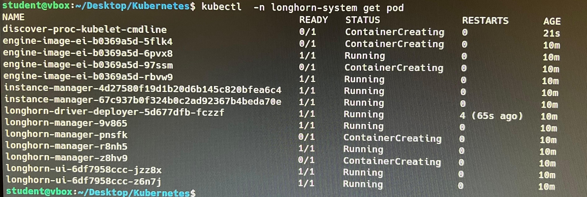

# Practica 3 - Container as a Service (CaaS) - Kubernetes


## Introduccion
A lo largo de esta practica, desplegaremos mediante Juju un cluster de Kubernetes sobre la arquitectura de red que hemos preparado durante las clases anteriores.
Habilitar un cluster de Kubernetes sobre nuestra arquitectura fisica nos permitira desplegar servicios y aplicaciones de forma sencilla y de forma simultanea y eficiente en distintas maquinas. 

Una vez desplegado el Cluster de Kubernetes, podremos gestionarlo mediante Juju. En particular, Juju nos permititrañ:
 - Desplegar nuevos servicios y sus aplicaciones.
 - Escalar: añadir y/o eliminar nuevas maquinas y unidades de forma sencilla.

Una vez desplegadas las maquinas y unidades, nistalaremos Helm y mediate su CLI, Longhorn. Longhorn nos permitirá añadir a nuestra nube de Kubernetes soporte de almacenamiento persistente. De esta forma, evitaremos que, aquella informacion que se deba guardar, se pierda al apagar el cluster.


## Instalación de un Cluster de Kubernetes de producción:
Para la instalacion del cluster de Kubernetes, primero crearemos un nuevo modelo, y luego ejecutaremos el siguiente comando:

```bash
juju add-model k8s maas-cloud
juju deploy charmed-kubernetes --overlay k8s-overlay.yaml
```


## Ajuste del Cluster mediante "k8s_overlay.yaml":
Como puede apreciarse en el comando anterior, se hace referenecia a un fichero "k8s_overlay.yaml". Este fichero nos permitirá ajustar el despliegue del cluster de Kubernetes, de la siguiente forma:
 - Crear solo 3 unidades Worker y elegir solo maquinas que tengan el tag "Worker" en MaaS.
 - No crear el balanceador de carga "Kubeapi-load-balancer".
 - Crear solo 1 unidad de cada "easyrsa", "etcd" y "kubernetes-control-plane", usando para  cada uno el tag correspondiente de la maquina. 


## Escalado horizontal del cluster:
Una vez que se ha desplegado el Cluster, se puede escalar este horizontalmente, añadiendo o quitando unidades e incluso desplegando nuevas maquinas con sus propias unidades. Esto, podremos hacerlo de varias maneras:

### Escalado horizontal añadiendo una maquina y luego sus unidades:
Podemos escalar el cluster ejecutando los siguientes comandos. En este caso, primero añadimos una maquina (seleccionando un equipo que tenga el tag "Worker") y luego añadimos a esta la unidad "Kubernetes-worker". En <machine-id> indicaremos el ID dado a la maquina

```bash
juju add-machine --constraints "tags=Worker"
juju status 
juju add-unit kubernetes-worker --to <machine-id>

```


### Escalado horizontal añadiendo unidades directamente a una maquina nueva:
Si la maquina no esta creada, podemos desplegar una nueva maquina y tambien añadir una unidad a esta (todo en un unico paso), mediante el siguiente comando.

```bash
juju add-unit kubernetes-worker
```


### Escalado horizontal añadiendo unidades directamente a una maquina ya desplegada:
Si la maquina ya esta creada, podemos añadir nuevas unidades a esta mediante el comando a continuacion

```bash
juju add-unit kubernetes-worker --to <machine-id>
```

### Eliminado de maquinas y unidades:
Finalmente, podremos eliminar aquelas maquinas / unidades que no necesitemos en nuestro cluster de Kubernetes. Para ello, usaremos los siguientes comandos:

Eliminar una unidad de una maquina: indicamos que servicio en <service-name> y el ID de la unidad en <unit-id>

```bash
juju remove-unit <service-name>/<unit-id>
#juju remove-unit kubernetes-worker/0
```

Eliminar una maquina: eliminamos una maquina completa, indicando el id de la maquina en <machine-id>

```bash
juju remove-machine <machine-id>
#juju remove-machine 1
```


## Instalacion del CLI y GUI de Kubectl:
Para poder instalar el CLI de Kubectl, debemos primero esperar a que se desplieguen completamente algunas unidades, como por ejemplo, "Kubernetes-control-plane". 

De esta maquina, obtendremos y copiaremos el fichero "config" de la siguiente manera:

```bash
sudo snap install kubectl --classic
kubectl version
mkdir ~/.kube
juju ssh kubernetes-control-plane/1 -- cat config > ~/.kube/config
```

El GUI se "instalara" haciendo un reenvio de puertos entre la maquina local y el servicio Kubernetes Dashboard, permitiendo asi el acceso desde fuera del cluster a un servicio que solo está en dicho cluster.

```bash
kubectl port-forward service/kubernetes-dashboard -n kubernetes-dashboard 8443:443
```

## Visualización del CLI y GUI de Kubectl:
Para poder instalar el CLI de Kubectl, debemos primero esperar a que se desplieguen completamente algunas unidades, como por ejemplo, "Kubernetes-control-plane". 

De esta maquina, obtendremos y copiaremos el fichero "config" de la siguiente manera:

```bash
sudo snap install kubectl --classic
kubectl version
mkdir ~/.kube
juju ssh kubernetes-control-plane/1 -- cat config > ~/.kube/config
```

El GUI se visualizará haciendo un reenvio de puertos entre la maquina local y el servicio Kubernetes Dashboard, permitiendo asi el acceso desde fuera del cluster a un servicio que solo está en dicho cluster.

```bash
kubectl port-forward service/kubernetes-dashboard -n kubernetes-dashboard 8443:443
```
Para poder acceder al Dashboard, nos conectamos desde el navegador a la URL "https://localhost:8443/". Despues será necesario indicar en la segunda opcion "kubeconfig file", que será el fichero que habremos btenido del K8s control plane en el paso anterior


Una vez realizado el acceso, podemos visualizar la nube desplegada seleccionando "All namespace" en el desplegable superior


## Instalación de Helm:
Para poder configurar y utilizar en el paso siguiente Longhorn, tendremos que instalar primero Helm. Para ello usaremos el siguiente comando:

```bash
sudo snap install helm --classic
```

## Instalación de Longhorn mediante Helm:

Añadir el repositorio Longhorn Helm:

```bash
helm repo add longhorn https://charts.longhorn.io
```
Fetch los útimos charts del repositorio:

```bash
helm repo update
```
Instalar Longhorn en el longhorn-system namespace.

```bash
helm install longhorn longhorn/longhorn --namespace longhorn-system --create-namespace --version 1.6.2
```
Para confirmar que el deploy se ha realizado, se ejecuta el comando:

```bash
kubectl -n longhorn-system get pod
```
El resultado es el siguiente:




Una vez configurado, podemos conectarnos al Dashboard de Longhorn de la siguiente manera:

```bash
kubectl port-forward service/longhorn-frontend -n longhorn-system 8001:80
```
tras realizar el reenvio de puertos para el dashboard, nos conectamos a este a traves de la URL: http://localhost:8001 


## Configuración de SSH en el resto de clientes (aquellos que no estan en el controlador MaaS):
Para poder conectarnos mediante SSH a las maquinas que hemos desplegado, será necesario realizar los siguientes pasoso en aquellos ordenadores en los que hayamos instalado clientes Juju:

### Copiamos el fichero id_rsa en los otros equipos:
El fichero "id_rsa" obtenido del equipo con el controlador MaaS del directorio home/student/.ssh tendra que copiarse en ese mismo directorio pero en los equipos que queremos configurar:

Una vez copiado el fichero en el directorio indicado, ejecutamos:

```bash
sudo chmod 600 id_rsa
```


@izaballa010


