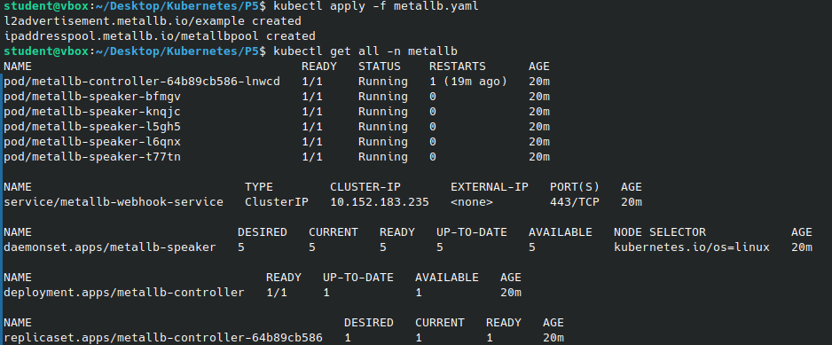
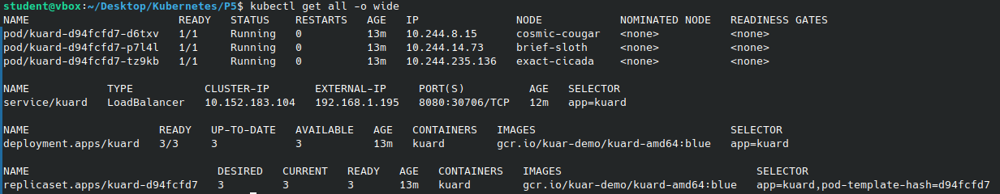
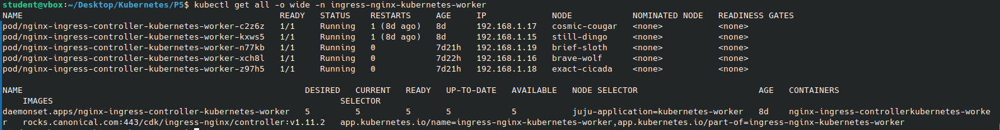
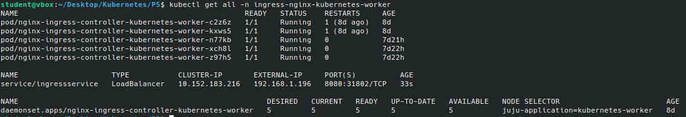
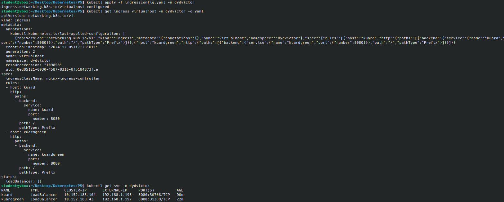

# Practica 5 - Escalabilidad y Disponibilidad en Kubernetes

# 1. LoadBlancer
Debemos implementar un balanceador de carga bare metal para nuestro clusters de Kubernetes. 

La instalacion la hacemos mediante la ejecucion de los siguientes comandos. Primero añadimos un nuevo repositorio de helm y luego instalamos metallb creando un namespace propio: 

```bash
helm repo add bitnami https://charts.bitnami.com/bitnami # añade un nuevo repositoio de helm
helm repo update
helm install -n metallb metallb bitnami/metallb --create-namespace # Para crear en una namespace 
```

Una vez instalado metallb, se necesita configurarlo para definir el rango de IPs que entregará a los servicios. Se usara un rango que excluya los rangos de direcciones IP que ya han sido usadas. Para eso creamos un ficheo "metallb.yaml", con el siguiente contenido:

```bash
apiVersion: metallb.io/v1beta1
kind: L2Advertisement
metadata:
  name: example
  namespace: metallb
spec:
  ipAddressPools:
  - metallbpool
---
apiVersion: metallb.io/v1beta1
kind: IPAddressPool
metadata:
  name: metallbpool
  namespace: metallb
spec:
  addresses:
  - 192.168.1.195-192.168.1.205
```

Aplicamos la configuración:
```bash
kubectl apply -f metallb.yaml
```



Ahora editamos el servicio kuard de la práctica anterior para que sea de tipo LoadBalancer. Para eso, usaremos un fichero .yaml en el que se indica tipo como LoadBalancer:

```bash
apiVersion: v1       # Versión de la API
kind: Service        # Tipo de objeto
metadata:    
  namespace: dydvictor       # Metadatos del objeto
  name: kuardgreen        # Nombre del servicio
spec:                # Especificaciones del servicio
  ports:             # Puertos del servicio
  - port: 8080       # Puerto expuesto
    targetPort: 8080 # Puerto al que se redirige
    protocol: TCP    # Protocolo utilizado
  selector:          # Selección de pods
    app: kuard       # Etiqueta para seleccionar los pods
  type: LoadBalancer    # Tipo de servicio
```

Aplicamos los cambios:
```bash
kubectl apply -f service.yaml
```

Para comprobar los cambios, verificamos que el servicio tiene una IP externa asignada usando el siguiente comando:

```bash
kubectl get all -o wide
```



La columna EXTERNAL-IP muestra la IP asignada por MetalLB. Vemos que es una IP dentro del rango que nosotros le hemos indicado para que entregue, y que no interfiere con el rango de direcciones ya asignadas a otros equipos.

Accedemos al servicio usando la IP externa en un navegador o con curl:

```bash
curl http://<EXTERNAL-IP>:8080
```

Si accedemos repetidamente, veremos que cambia la direccion IP del equipo que sirve contenido, siendo una de las 3 IPs que tiene cada uno de los PODs desplegados.


# 2.Ingress

Utilizaremos Ingress para conseguir realizar un balanceo a nivel HTTP (L7). Para eso, debemos primero exponer el servicio de Ingress. Consultamos las etiquetas de los pods de Ingress mediante cualquiera de los siguientes comandos:

```bash
kubectl get pods -n ingress-nginx-kubernetes-worker --show labels
#kubectl get all -o wide -n ingress-nginx-kubernetes-worker
```



Identificadas estas etiquetas, las incluimos en el selector, para asi indicar los pods a los que queremos que se redirija el trafico. Aplicamos el fichero serviceingress.yaml:

```bash
apiVersion: v1       # Versión de la API
kind: Service        # Tipo de objeto
metadata:
  name: ingressservice        # Nombre del servicio
spec:
  selector: # Especificaciones del servicio
    app.kubernetes.io/name: ingress-nginx-kubernetes-worker
  ports:             # Puertos del servicio
  - port: 8080       # Puerto expuesto
    targetPort: 8080 # Puerto al que se redirige
    protocol: TCP    # Protocolo utilizado
  type: LoadBalancer    # Tipo de servicio
```

Tras el despliegue, verificamos la IP externa para comprobar que se asigna una IP correcta al servicio ingress-nginx (Tomar nota de la IP externa para usarla más adelante):

```bash
kubectl get svc -n ingress-nginx # 192.168.1.196
```

Ahora, creamos dos despliegues y servicios. Uno, será el de la practica anterior, y el segundo una version similar pero con otro nombre y que parte de la imagen "green" de Kuard.
  1º Deployment y servicio del apartado anterior (kuard)
  2º Deployment y servicio con la image de la version green (kuardgreen)

El resultado de desplegar tanto ambos servicios como Ingress:




Una vez desplegado Ingress, editamos el archivo /etc/hosts para asociar la IP externa del servicio ingress-nginx a dos nombres diferentes. Para ello:

```bash
sudo nano /etc/hosts
```

Agregamos estas líneas al final del fichero: 

```bash
192.168.1.196 kuard
192.168.1.196 kuardgreen
```


Aplicar el manifiesto actualizado:
```bash
kubectl apply -f ingressconfig.yaml
```
```
apiVersion: networking.k8s.io/v1
kind: Ingress
metadata:
  name: virtualhost
spec:
  rules:
  - host: kuard
    http:
      paths:
      - path: /
        pathType: Prefix
        backend:
          service:
            name: kuard
            port:
              number: 8080

  - host: "kuardgreen"
    http:
      paths:
      - path: /
        pathType: Prefix
        backend:
          service:
            name: kuardgreen
            port:
              number: 8080
```

Este manifiesto define un recurso Ingress en Kubernetes, que actúa como un enrutador HTTP/S para exponer servicios desde del clúster hacia el exterior. 
Hay alguno aspectos a tener en cuenta:

-Está identificado como virtualhost.
-Reglas de Enrutamiento:

-Definimos dos reglas para enrutar tráfico HTTP en función del nombre del host:

-Host 1: kuard:
Todo el tráfico dirigido a este host (/) será enviado al servicio kuard en el puerto 8080.

-Host 2: kuardgreen:
Todo el tráfico dirigido a este host (/) será enviado al servicio kuardgreen en el puerto 8080.
Tipo de Ruta:

El pathType está configurado como Prefix, lo que significa que se aplicará a todas las rutas que comiencen con el prefijo especificado (/).
Esta declarativa indica cómo enrutar tráfico HTTP de dos hosts (kuard y kuardgreen) hacia los servicios correspondientes (kuard y kuardgreen), ambos escuchando en el puerto 8080. Será para implementar nuestro balanceador de carga.

Ahora vemos la lista de servicios creados en los clúster de Kubernetes, sus direcciones IP y los puertos de acceso que exponen los recursos dentro del clúster.


Desde el navegador web:
- Acceder a http://kuard para verificar que responde el servicio kuard.
- Acceder a http://kuardgreen para verificar que responde el servicio kuardgreen.
Refrescar la página varias veces y observar cómo las respuestas provienen de diferentes pods, lo que indica que el balanceo de carga funciona.

-La practica se realizó hasta este punto. Pues, no recibíamos respuesta cuanto haciamos peticiones a traves de las direcciones y puertos que exponiann los servicios Kuard y Kuardgreen. Estabamos buscando la razon de la falla y la solución . 
