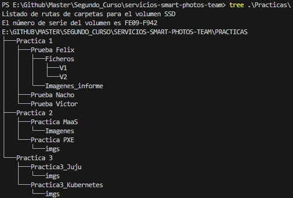

# Smart Photos Team

## Participantes

- Felix Sanz <fsanz003@ikasle.ehu.eus>
- Ignacion Zaballa <izaballa010@ikasle.ehu.eus>
- Victor Hugo Contreras <vcontreras002@ikasle.ehu.eus>

## Descripción

El proyecto a realizar por este grupo se llama "Smart Photos".

Smart Photos es una plataforma online que permitirá a los usuarios  añadir y alojar contenidos multimedia como fotografias y videos.
Esta plataforma no solo almacenará el contenido en el formato y calidad original, sino que, a petición del usuario, permitirá 
variar estos formatos y calidades. 

## Organización del repositorio

- Cada práctica dispondrá de su directorio.
- En la Práctica 1 habrá un directorio para cada componente del equipo, donde se indicará lo realizado por cada uno en un fichero Readme por cada directorio.

